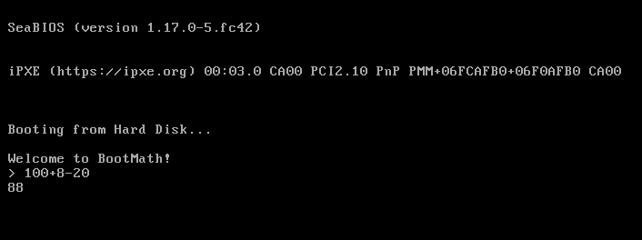

# Bootmath
Simple x86 Realmode calculator



## Usage
> Requires NASM

> Requires QEMU
#### 1. Clone the repo
```bash
git clone https://github.com/zro404/bootmath.git
cd bootmath
```

#### 2. Run with QEMU:
```bash
make run
```

#### Debug with GDB
```bash
make debug
```
